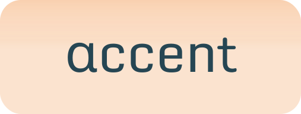

<div align="center">
  
</div>

&nbsp;

**accent** — это простой и лёгкий инструмент для тренировки ударений, грамматики и пунктуации в русском языке. Подходит для школьников, абитуриентов и всех, кто хочет повысить свою грамотность. Все задания схожи с ЕГЭ, а конкретно с 4-ым, 7-ым, 17-ым и с 18-ым номерами.

Проект написан на чистом HTML, CSS и JavaScript без использования сторонних библиотек. Это обеспечивает быструю загрузку и лёгкость в доработке. Интерфейс адаптивный, работает во всех современных браузерах.

Дальнейшие крупные обновления не намечаются, возможны только небольшие исправления. Любые дополнения от других разработчиков (форки) приветствуются.

## Технологии
* HTML
* CSS
* JavaScript
* Python (для локального запуска сервера через `server.py`)

## Установка и использование
Существуют три варианта использования:
- Через локальный сервер,
- Android-приложение (в разработке, релизы будут доступны [здесь](https://github.com/maltmast/accent/releases)),
- [Онлайн-версия на GitHub Pages](https://maltmast.github.io/accent/index.html).

### Установка локального сервера
1. Скачайте и распакуйте этот репозиторий или склонируйте через git:
```
git clone https://github.com/maltmast/accent.git
```
2. Используйте стороннюю программу для запуска сервера или запустите `server.py`:
```
cd accent
python3 server.py
```

## Авторы
* [Мальцев Матвей](https://github.com/maltmast)
* [Рубцов Семён](https://github.com/has7nae)